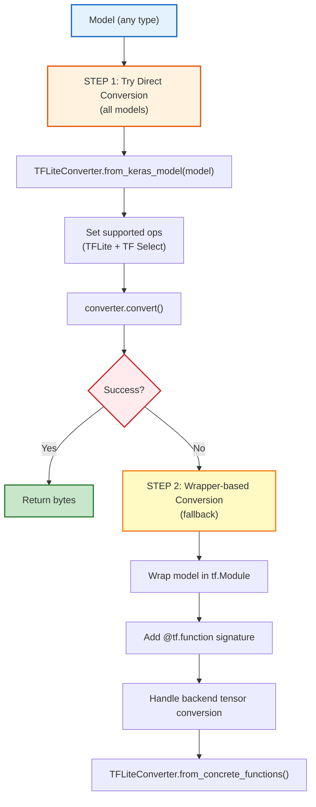

# LiteRT Model Export design document

# **Self link:** [go/keras-litert](http://goto.google.com/keras-litert)

| \#begin-approvals-addon-section Username Role Status Last change [amitsrivasta](http://teams/amitsrivasta) Approver 🟡 Pending Oct 27, 2025 [fhertschuh](http://teams/fhertschuh) Approver 🟡 Pending Oct 27, 2025 [mattdangerw](http://teams/mattdangerw) Approver 🟡 Pending Oct 27, 2025 [petrychenko](http://teams/petrychenko) Approver 🟡 Pending Oct 27, 2025 [abheesht](http://teams/abheesht) Reviewer 🟡 Pending Oct 27, 2025 [divyasreepat](http://teams/divyasreepat) Reviewer 🟡 Pending Oct 27, 2025 [jyotindersingh](http://teams/jyotindersingh) Reviewer 🟡 Pending Oct 27, 2025 [monicadsong](http://teams/monicadsong) Reviewer 🟡 Pending Oct 27, 2025 [ssaadat](http://teams/ssaadat) Reviewer 🟡 Pending Oct 27, 2025 [suhanaaa](http://teams/suhanaaa) Reviewer 🟡 Pending Oct 27, 2025      ![][image1] Approval Instructions: Please approve or LGTM through the [G3 Assist](https://goto.google.com/g3a-approvals-reviewing) sidebar. For more information, see [go/g3a-approvals-reviewing](https://goto.google.com/g3a-approvals-reviewing)  |
| ----- |

**Visibility**: Public *See [go/data-security-policy](https://goto.google.com/data-security-policy) for definitions if you want to change this.*  
**Status**: Review  
**Authors**: [Rahul Kumar](mailto:hellorahul@google.com)  
**Contributors**: Person, Person  
**Last major revision**: Nov 10, 2025

# Attached PRs:  {#attached-prs:}

1. [**https://github.com/keras-team/keras/pull/21674**](https://github.com/keras-team/keras/pull/21674)  
2. [**https://github.com/keras-team/keras-hub/pull/2405**](https://github.com/keras-team/keras-hub/pull/2405)

# Context

## 1\. Objective

**Stage 1 (This Document)**: Enable seamless one-line export of Keras and Keras-Hub models to LiteRT (TensorFlow Lite) format for on-device inference, making mobile and edge deployment accessible to all Keras users without requiring manual TFLite converter knowledge.

**Stage 2 (Future Work)**: Develop comprehensive Android/iOS runtime libraries with preprocessing and postprocessing APIs to simplify on-device inference. This will include:

* C++/Java/Kotlin inference wrappers for mobile platforms  
* Task-specific preprocessing (tokenization for text models, image normalization for vision models)  
* Postprocessing utilities (argmax, NMS, detokenization, etc.)  
* Generalization over model export configs  
* See [Keras-Hub Android](https://docs.google.com/document/d/1_2o-HB1iCt2KHdzvvT9y3XoSz3dPvRbnmTtpDDZad-g/edit?usp=sharing) for more details

### 1.1 What is LiteRT Export?

Enable seamless export of Keras and KerasHub models to LiteRT (TensorFlow Lite) format through a unified `model.export()` API, supporting deployment to mobile, embedded, and edge devices.

**Quick Example:**

```py
import keras
import keras_hub
import tensorflow as tf

# Keras Core model - must have at least one layer
model = keras.Sequential([
    keras.layers.Dense(10, input_shape=(784,))
])
model.export("model.tflite", format="litert")

# Keras-Hub model - from_preset() includes preprocessor
model = keras_hub.models.GemmaCausalLM.from_preset("gemma_2b")
model.export("model.tflite",format="litert", max_sequence_length=128)

# With quantization 
model.export(
    "model_quantized.tflite",
    format="litert",
    litert_kwargs={
        "optimizations": [tf.lite.Optimize.DEFAULT]
    }
)
```

### 1.2 Why liteRT

**Problem Statement:**

Keras 3 introduced multi-backend support (TensorFlow, JAX, PyTorch), breaking the existing TFLite export workflow from Keras 2.x. Additionally:

* Manual export required multiple steps with TensorFlow Lite Converter  
* KerasHub models use dictionary inputs incompatible with TFLite's list-based interface  
* Error-prone manual configuration of converter settings, too much complication to handle complex models with various input structures. We get multiple errors while converting a CausalLM.

**Impact:**

Without this feature, users must manually handle SavedModel conversion, input signature wrapping, and adapter pattern implementation \- a complex process requiring deep TensorFlow knowledge.

### 1.3 Target Customers

* **ML Engineers:** Deploying trained models to production  
* **Mobile Developers:** Integrating .tflite models into apps  
* **Backend Engineers:** Building automated export pipelines

**Prerequisites:** Basic familiarity with Keras model types and model deployment concepts.

## 2\. Background

### 2.1 LiteRT (TensorFlow Lite) Overview

**What is LiteRT?** LiteRT (formerly TensorFlow Lite) is TensorFlow's device runtime for deploying ML models on mobile, embedded, and edge devices with optimized inference.

**Key Characteristics:**

* Optimized for on-device inference (low latency, small binary size)  
* Supports Android, iOS, embedded Linux, microcontrollers  
* Uses flatbuffer format (.tflite files)  
* Requires positional (list-based) input arguments, not dictionary inputs

### 2.2 The Problem: Broken Export in Keras 3.x

Most of the models from kerasHub fail to export giving multiple errors. Some errors are `_DictWrapper` related errors, unable to trace the complete model graph, generating a `.tflite` without weights.

**Before these [PRs:](#attached-prs:)**

```py
# Old way: Manual 5-step process (Keras 2.x or Keras 3.x)
import tensorflow as tf

# 1. Save model as SavedModel
model.save("temp_saved_model/", save_format="tf")

# 2. Load converter
converter = tf.lite.TFLiteConverter.from_saved_model("temp_saved_model/")

# 3. Configure converter (ops, optimization, etc.)
converter.target_spec.supported_ops = [
    tf.lite.OpsSet.TFLITE_BUILTINS,
    tf.lite.OpsSet.SELECT_TF_OPS
]

# 4. Convert to TFLite bytes
tflite_model = converter.convert()

# 5. Write to file
with open("model.tflite", "wb") as f:
    f.write(tflite_model)
```

**Issues with manual approach:**

* No native LiteRT export in Keras 3.x (SavedModel API changed)  
* KerasHub models with dict inputs couldn't export (TFLite expects lists)  
* Requires understanding TFLite converter internals  
* Keras does have an API for `model.export` but it fails on most models, throwing errors.

**After these PRs:**

```py
# New way: Single line
model.export("model.tflite", format="litert")
```

**Benefits:**

* Single model.export(filepath, format="litert") API across all model types  
* Automatic handling of complex input structures (dicts or nested dicts converted to lists)  
* Train on any backend JAX/PyTorch/TensorFlow and export to LiteRT.  
* Unified experience across Keras Core and KerasHub models

### 2.3 Key Challenges

* **Dictionary Input Problem:** KerasHub models expect dictionary inputs like `{"token_ids": [...], "padding_mask": [...]}`, but TFLite requires positional list inputs  
* **Multi-Backend Compatibility:** Models trained with JAX or PyTorch backends on keras need TensorFlow conversion for TFLite.  
  For non keras solutions, there are open source tools for conversion to .tflite  
  1. [GitHub \- google-ai-edge/ai-edge-torch: Supporting PyTorch models with the Google AI Edge TFLite runtime.](https://github.com/google-ai-edge/ai-edge-torch) This is open source and directly converts to .tflite without need for tensorflow.  
  2. [AI Edge JAX](https://g3doc.corp.google.com/third_party/py/ai_edge_jax/g3doc/index.md?cl=head) **Google internal** solution to convert jax model to .tflite  
* For keras we have below solutions for different backend.  
1. Tensorflow: to use some wrapper over model call function, convert to tf concrete function, and use `tf.lite.TFLiteConverter` to generate the .tflite file.  
2. Jax: to use JAX module from orbax-export library, to convert the model graph to tf concrete function, then use tf.lite.TFLiteConverter to convert to .tflite .  
3. Torch: We need to convert the model to torch module, then use AI-Edge-Torch to generate the .tflite file.   
* **Input Signature Inference:** Different model types (Functional, Sequential, Subclassed) have different ways to introspect input shapes  
* **Code Organization:** Avoid duplication between Keras Core and KerasHub implementations

## 3\. Goals

### 3.1 Primary Goals

1. **Unified API:** Single model.export(filepath, format="litert") works across all Keras and Keras-Hub models  
2. **Zero Manual Configuration:** Automatic input signature inference, format detection, and converter setup  
3. **Dict-to-List Conversion:** Transparent handling of Keras-Hub's dictionary inputs  
4. **Backend Agnostic:** Export models trained with any backend (TensorFlow, JAX, PyTorch)

### 3.2 Non-Goals

* ONNX export (separate feature)  
* Quantization using keras `model.quantize()` (use TFLite APIs directly)  
* Custom operator registration (requires TFLite tooling)  
* Runtime optimization tuning (TFLite's responsibility)

### 3.3 Success Metrics

* All Keras model types (Functional, Sequential, Subclassed) export successfully  
* All Keras-Hub model types (text, vision, audio, and multimodal tasks) export successfully  
* Models trained with JAX/PyTorch export without manual TensorFlow conversion  
* Zero-config export for 95%+ use cases (only edge cases need explicit configuration)

## 4\. Detailed Design

### 4.1 System Architecture

The export system uses a **two-layer architecture** with clear separation of concerns:

**Architecture Overview:**

```mermaid
flowchart TD
    A["<b>USER CODE</b><br/><br/>model.export('model.tflite', format='litert')"]
    
    B["<b>KERAS-HUB LAYER</b><br/>Domain-specific configuration<br/><br/>• Config classes per model type<br/>(CausalLM, ImageClassifier, Seq2SeqLM, etc.)<br/><br/>• Input signature creation with defaults<br/>(sequence_length for text, image_size for vision)<br/><br/>• Model type detection via get_exporter_config()"]
    
    C["<b>KERAS CORE LAYER</b><br/>Export mechanics<br/><br/>• Dict input detection and adapter creation<br/><br/>• TFLite conversion<br/>(direct or wrapper-based fallback)"]
    
    D["<b>OUTPUT</b><br/><br/>model.tflite (list-based interface)"]
    
    A --> B
    B --> C
    C --> D
    
    style A fill:#e1f5ff,stroke:#01579b,stroke-width:2px
    style B fill:#fff3e0,stroke:#e65100,stroke-width:2px
    style C fill:#f3e5f5,stroke:#4a148c,stroke-width:2px
    style D fill:#e8f5e9,stroke:#1b5e20,stroke-width:2px
```



**Key Design Principles:**

1. **Separation of Concerns:** 
   - Keras-Hub: Domain knowledge (model types, input requirements, defaults)
   - Keras Core: Export mechanics (dict handling, TFLite conversion)

2. **Direct Delegation:** Keras-Hub config classes call Keras Core export_litert() directly (no wrapper classes)

3. **Adapter Pattern:** Automatic dict->list conversion for TFLite compatibility

4. **Universal Applicability:** Works for any Keras model with dict inputs (not just Keras-Hub)

5. **Registry Pattern:** Config selection based on model type (isinstance checks)

6. **Automatic Integration:** Configs auto-use preprocessor.sequence_length when available

**Supported Model Types:**
- **Task Models:** CausalLM, TextClassifier, ImageClassifier, Seq2SeqLM, ObjectDetector, ImageSegmenter
- **Backbone Models:** GemmaBackbone, BertBackbone, etc.

**Important Notes:**

* **Adapter Overhead:** The adapter wrapper only exists during export. The generated .tflite file contains the original model weights \- no runtime overhead.  
*  **Backend Compatibility:** Models can be trained with any backend (JAX, PyTorch, TensorFlow) and saved to .keras format. However, for LiteRT export, the model must be loaded with TensorFlow backend during conversion. The exporter handles tensor conversion transparently, but TensorFlow backend is required for TFLite compatibility. If your model uses operations not available in TensorFlow, you'll get a conversion error.  
* **Op Compatibility:** Check if your layers use [TFLite-supported operations](https://www.tensorflow.org/lite/guide/ops_compatibility). Unsupported ops will cause conversion errors. Enable verbose=True during export to see which ops are problematic.

### 4.2 Keras Core Implementation

Location: `keras/src/export/litert.py`

**Responsibilities:**

* Export Functional, Sequential, and Subclassed Keras models  
* Infer input signatures from model structure  
* **Detect and handle dictionary inputs automatically**
* **Create adapters for dict->list conversion**
* Convert to TFLite using TensorFlow Lite Converter

**Export Pipeline:**

```mermaid
flowchart TD
    A["export_litert(model, filepath, input_signature)"]
    B["1. Infer input signature if not provided<br/>• Check _inputs_struct for dict inputs<br/>• Fall back to model.inputs"]
    C["2. Detect dictionary inputs<br/>(_has_dict_inputs)<br/>• Check model.inputs type<br/>• Check _inputs_struct<br/>• Check provided input_signature"]
    D["3. If dict inputs: Create adapter<br/>(_create_dict_adapter)<br/>• Create Input layers for list inputs<br/>• Convert list->dict internally<br/>• Wrap original model"]
    E["4. Convert to TFLite<br/>(_convert_to_tflite)<br/>• Try direct conversion first<br/>• Fall back to wrapper-based conversion if needed"]
    F["5. Save .tflite file"]
    
    A --> B
    B --> C
    C --> D
    D --> E
    E --> F
    
    style A fill:#e3f2fd,stroke:#1565c0,stroke-width:2px
    style C fill:#fff9c4,stroke:#f57f17,stroke-width:2px
    style D fill:#fff9c4,stroke:#f57f17,stroke-width:2px
    style E fill:#f3e5f5,stroke:#4a148c,stroke-width:2px
```



### 4.3 Input Signature Strategy by Model Type

**CRITICAL: Functional Model Signature Wrapping**

Functional models with dictionary inputs require special handling: the signature must be wrapped in a single-element list `[input_signature_dict]` rather than passed directly as a dict. This is because Functional models' call() signature expects one positional argument containing the full nested structure, not multiple positional arguments.

**Design Decision:** Different model types have different call signatures, requiring type-specific handling.

| Model Type | Signature Format | Reason | Auto-Inference? |
| :---- | :---- | :---- | :---- |
| **Functional** | Single-element list \[nested\_inputs\] | call() expects one positional arg with full structure | Yes (from model.inputs) |
| **Sequential** | Flat list \[input1, input2, ...\] | call() maps over inputs directly | Yes (from model.inputs) |
| **Subclassed** | Inferred from first call | Dynamic call() signature not statically known | Only if model built |

### 4.4 Conversion Strategy Decision Tree



**Important:** The code first tries direct conversion of all model types (Functional, Sequential, and Subclassed). Wrapper-based conversion is only used as a fallback if direct conversion fails.

**Why Two Strategies?**

1. **Direct Conversion (attempted first):**  
   * Simpler and faster path  
   * Works for most well-formed models  
   * TFLite converter directly inspects Keras model structure  
2. **Wrapper-based (fallback when direct fails):**  
   * Required when direct conversion encounters errors  
   * Provides explicit concrete function with @tf.function  
   * Handles edge cases and complex model structures  
   * Multiple retry strategies for better compatibility

#### 4.4.1 Wrapper-Based Conversion

**What it is:** A `tf.Module` that wraps the model with an explicit `@tf.function(input_signature=...)`, creating a concrete computation graph that TFLite can reliably convert.

**Why needed:** Direct conversion (`TFLiteConverter.from_keras_model()`) can fail even for TensorFlow backend models due to:
- SavedModel serialization errors with dictionary inputs (`_DictWrapper` error)
- Subclassed models where TFLite cannot introspect the call signature
- Complex control flow or dynamic behavior that breaks automatic graph tracing

**How it works:** Instead of `TFLiteConverter.from_keras_model()`, the exporter:
1. Creates a `tf.Module` wrapper that prevents `_DictWrapper` tracking errors
2. Generates a concrete function with explicit `tf.TensorSpec` via `@tf.function.get_concrete_function()`
3. Converts using `TFLiteConverter.from_concrete_functions([concrete_fn])`

**When invoked:** Automatically as fallback when direct conversion fails. Transparent to users regardless of backend.

**Key advantage:** Enables conversion of models with dictionary inputs or complex structures that cause SavedModel serialization errors. No runtime overhead—wrapper exists only during export.

### 4.5 Keras-Hub Integration

**Location:** `keras_hub/src/export/`

Keras-Hub provides a minimal layer focused solely on domain-specific input signature generation. All export mechanics are handled by Keras Core.

**File Structure:**
```
keras_hub/src/export/
├── configs.py          # Config classes + base class (all in one file)
├── litert.py          # Convenience wrapper function
└── __init__.py        # Public API exports
```

#### 4.5.1 Configuration System

**Purpose:** Configs provide **domain-specific metadata** that can't be inferred from model structure:
- Input names (`token_ids` vs `encoder_token_ids`)
- Dimension semantics (which `None` is sequence_length vs batch)
- Type-specific defaults (sequence_length from preprocessor for text models)
- Automatic fallback to preprocessor settings when parameters not provided

**Note:** Dict-to-list conversion is automatic in Keras Core. Configs only define what the input signature should look like.

Keras-Hub uses **one config class per model type** (not per model instance). All GPT/Gemma/LLaMA models share `CausalLMExporterConfig`:

```mermaid
flowchart TB
    A["User calls model.export()"]
    B["Task.export() in task.py"]
    C["get_exporter_config(model)"]
    D["Detect Model Type via isinstance()"]
    
    E1["CausalLMExporterConfig"]
    E2["TextClassifierExporterConfig"]
    E3["ImageClassifierExporterConfig"]
    E4["Seq2SeqLMExporterConfig"]
    E5["ObjectDetectorExporterConfig"]
    E6["Other configs..."]
    
    F["Config.get_input_signature()<br/>(auto-uses preprocessor settings)"]
    G["Keras Core export_litert()"]
    H["Dict→list adapter + TFLite conversion"]
    
    A --> B
    B --> C
    C --> D
    D --> E1
    D --> E2
    D --> E3
    D --> E4
    D --> E5
    D --> E6
    
    E1 --> F
    E2 --> F
    E3 --> F
    E4 --> F
    E5 --> F
    E6 --> F
    
    F --> G
    G --> H
    
    style A fill:#e1f5ff,stroke:#01579b,stroke-width:2px
    style D fill:#fff3e0,stroke:#e65100,stroke-width:2px
    style F fill:#f3e5f5,stroke:#4a148c,stroke-width:2px
    style H fill:#c8e6c9,stroke:#2e7d32,stroke-width:2px
```



**Simplified Architecture:**
- No separate `LiteRTExporter` class - direct delegation to Keras Core
- Config classes only provide input signatures
- All export mechanics handled by Keras Core's `export_litert()`

**Supported Model Types:**
- **Text:** CausalLM, TextClassifier, Seq2SeqLM, AudioToText
- **Vision:** ImageClassifier, ObjectDetector, ImageSegmenter, DepthEstimator  
- **Multimodal:** Gemma3, PaliGemma, CLIP
- **Generative:** TextToImage (Stable Diffusion)

#### 4.5.2 Input Signature Construction

Each config implements `get_input_signature()` to create proper input specs:

**Text Models:**
```python
# CausalLM, TextClassifier
{
    "token_ids": InputSpec(dtype="int32", shape=(None, sequence_length)),
    "padding_mask": InputSpec(dtype="int32", shape=(None, sequence_length))
}

# Seq2SeqLM
{
    "encoder_token_ids": InputSpec(dtype="int32", shape=(None, seq_len)),
    "encoder_padding_mask": InputSpec(dtype="int32", shape=(None, seq_len)),
    "decoder_token_ids": InputSpec(dtype="int32", shape=(None, seq_len)),
    "decoder_padding_mask": InputSpec(dtype="int32", shape=(None, seq_len))
}
```

**Vision Models:**
```python
# ImageClassifier, ObjectDetector (single input - not a dict!)
InputSpec(dtype="float32", shape=(None, height, width, 3))

# ImageSegmenter (uses 'inputs' not 'images')
InputSpec(dtype="float32", shape=(None, height, width, 3), name="inputs")
```

**Multimodal Models:**
```python
# Gemma3 (vision encoder + text)
{
    "token_ids": InputSpec(dtype="int32", shape=(None, seq_len)),
    "padding_mask": InputSpec(dtype="int32", shape=(None, seq_len)),
    "images": InputSpec(dtype="float32", shape=(None, None, size, size, 3)),
    "vision_mask": InputSpec(dtype="int32", shape=(None, None)),
    "vision_indices": InputSpec(dtype="int32", shape=(None, None))
}
```

#### 4.5.3 Key Features

**Why separate configs per model type?** Each type needs different domain knowledge:
- Text: `sequence_length` parameter → inject into shape[1]
- Vision: `image_size` parameter → inject into shape[1:3] 
- Seq2Seq: Both encoder and decoder sequence lengths
- Where to get defaults: automatically from preprocessor's `sequence_length` attribute

**Auto-detection:** `get_exporter_config()` uses `isinstance()` with priority ordering

**Dynamic shapes:** When parameters are `None`, exports with flexible dimensions for runtime resizing


**Separation of Concerns:** 
- Keras-Hub: Provides domain knowledge (input signatures with automatic preprocessor defaults)
- Keras Core: Handles all export mechanics (dict conversion, TFLite compilation)

### 4.6 Complete Export Pipeline

The complete export flow from user code to deployed .tflite file:


## 5\. Usage Examples

Please refer to the [guide](https://github.com/pctablet505/litert-export-docs/tree/main)

### 5.1 Quantization and Optimization

Quantization reduces model size (\~75% reduction) and improves inference speed by converting weights from float32 to int8. Use the litert\_kwargs parameter to enable optimizations.

**Basic Quantization**

```py
import tensorflow as tf

# Dynamic range quantization (simplest - no dataset needed)
model.export(
    "model_quantized.tflite",
    format="litert",
    litert_kwargs={
        "optimizations": [tf.lite.Optimize.DEFAULT]
    }
)

# Full integer quantization (best performance - requires dataset)
def representative_dataset():
    for i in range(100):
        yield [training_data[i].astype(np.float32)]

model.export(
    "model_int8.tflite",
    format="litert",
    litert_kwargs={
        "optimizations": [tf.lite.Optimize.DEFAULT],
        "representative_dataset": representative_dataset
    }
)
```

**Refer to the guide for more details.**

## 6\. Known Limitations

### 6.1 Memory Requirements During Conversion

**Issue:** TFLite conversion requires 10x or more RAM than model size.

**Example:** A gemma3\_1B model may need 45 GB+ of peak RAM usage during conversion.

**Root Cause:** TensorFlow Lite Converter builds multiple intermediate graph representations in memory.

**Workarounds:**

* Use a machine with sufficient RAM (cloud instance for large models)  
* The generated .tflite file will be normal size (no bloat)  
* Consider model quantization to reduce model size before export

**Status:** This is a TFLite Converter limitation, not fixable in Keras export code.  
This is a known issue by the TFLite team and  literRT team, and they don’t have any fix.

