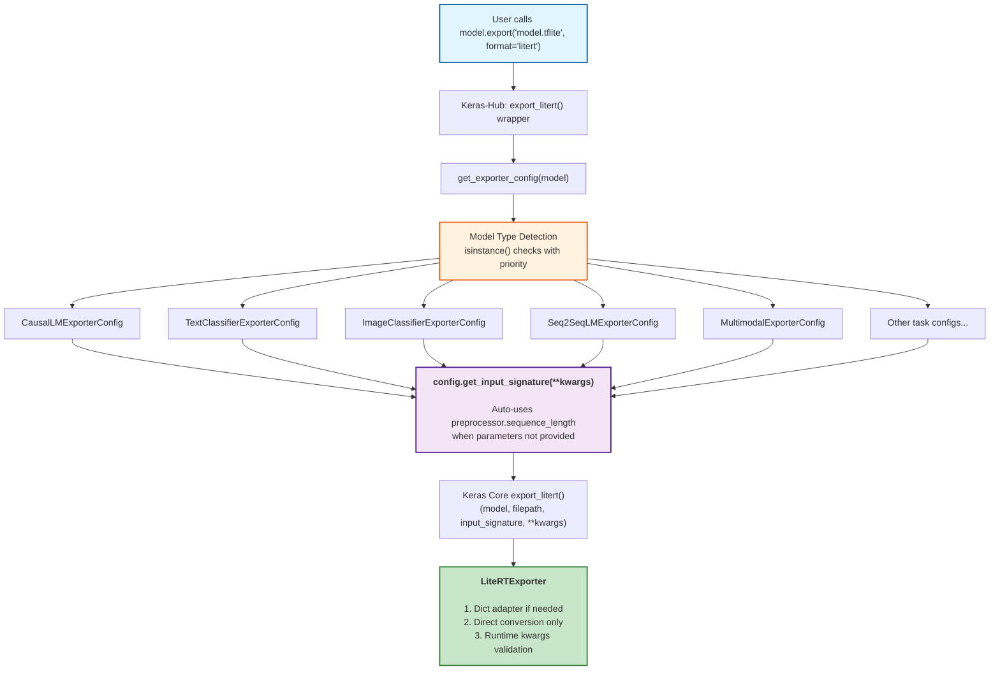

# LiteRT Model Export design document

# **Self link:** [go/keras-litert](http://goto.google.com/keras-litert)

| \#begin-approvals-addon-section Username Role Status Last change [amitsrivasta](http://teams/amitsrivasta) Approver 🟡 Pending Oct 27, 2025 [fhertschuh](http://teams/fhertschuh) Approver 🟡 Pending Oct 27, 2025 [mattdangerw](http://teams/mattdangerw) Approver 🟡 Pending Oct 27, 2025 [petrychenko](http://teams/petrychenko) Approver 🟡 Pending Oct 27, 2025 [abheesht](http://teams/abheesht) Reviewer 🟡 Pending Oct 27, 2025 [divyasreepat](http://teams/divyasreepat) Reviewer 🟡 Pending Oct 27, 2025 [jyotindersingh](http://teams/jyotindersingh) Reviewer 🟡 Pending Oct 27, 2025 [monicadsong](http://teams/monicadsong) Reviewer 🟡 Pending Oct 27, 2025 [ssaadat](http://teams/ssaadat) Reviewer 🟡 Pending Oct 27, 2025 [suhanaaa](http://teams/suhanaaa) Reviewer 🟡 Pending Oct 27, 2025      ![][image1] Approval Instructions: Please approve or LGTM through the [G3 Assist](https://goto.google.com/g3a-approvals-reviewing) sidebar. For more information, see [go/g3a-approvals-reviewing](https://goto.google.com/g3a-approvals-reviewing)  |
| ----- |

**Visibility**: Public *See [go/data-security-policy](https://goto.google.com/data-security-policy) for definitions if you want to change this.*  
**Status**: Review  
**Authors**: [Rahul Kumar](mailto:hellorahul@google.com)  
**Contributors**: Person, Person  
**Last major revision**: Nov 10, 2025

# Attached PRs:  {#attached-prs:}

1. [**https://github.com/keras-team/keras/pull/21674**](https://github.com/keras-team/keras/pull/21674)  
2. [**https://github.com/keras-team/keras-hub/pull/2405**](https://github.com/keras-team/keras-hub/pull/2405)

# Context

## 1\. Objective

**Stage 1 (This Document)**: Enable seamless one-line export of Keras and Keras-Hub models to LiteRT (TensorFlow Lite) format for on-device inference, making mobile and edge deployment accessible to all Keras users without requiring manual TFLite converter knowledge.

**Stage 2 (Future Work)**: Develop comprehensive Android/iOS runtime libraries with preprocessing and postprocessing APIs to simplify on-device inference. This will include:

* C++/Java/Kotlin inference wrappers for mobile platforms  
* Task-specific preprocessing (tokenization for text models, image normalization for vision models)  
* Postprocessing utilities (argmax, NMS, detokenization, etc.)  
* Generalization over model export configs  
* See [Keras-Hub Android](https://docs.google.com/document/d/1_2o-HB1iCt2KHdzvvT9y3XoSz3dPvRbnmTtpDDZad-g/edit?usp=sharing) for more details

### 1.1 What is LiteRT Export?

Enable seamless export of Keras and KerasHub models to LiteRT (TensorFlow Lite) format through a unified `model.export()` API, supporting deployment to mobile, embedded, and edge devices.

**Quick Example:**

```py
import keras
import keras_hub
import tensorflow as tf

# Keras Core model - must have at least one layer
model = keras.Sequential([
    keras.layers.Dense(10, input_shape=(784,))
])
model.export("model.tflite", format="litert")

# Keras-Hub model - from_preset() includes preprocessor
model = keras_hub.models.GemmaCausalLM.from_preset("gemma_2b")
model.export("model.tflite",format="litert", max_sequence_length=128)

# With quantization 
model.export(
    "model_quantized.tflite",
    format="litert",
    litert_kwargs={
        "optimizations": [tf.lite.Optimize.DEFAULT]
    }
)
```

### 1.2 Why liteRT

**Problem Statement:**

Keras 3 introduced multi-backend support (TensorFlow, JAX, PyTorch), breaking the existing TFLite export workflow from Keras 2.x. Additionally:

* Manual export required multiple steps with TensorFlow Lite Converter  
* KerasHub models use dictionary inputs incompatible with TFLite's list-based interface  
* Error-prone manual configuration of converter settings, too much complication to handle complex models with various input structures. We get multiple errors while converting a CausalLM.

**Impact:**

Without this feature, users must manually handle SavedModel conversion, input signature wrapping, and adapter pattern implementation \- a complex process requiring deep TensorFlow knowledge.

### 1.3 Target Customers

* **ML Engineers:** Deploying trained models to production  
* **Mobile Developers:** Integrating .tflite models into apps  
* **Backend Engineers:** Building automated export pipelines

**Prerequisites:** Basic familiarity with Keras model types and model deployment concepts.

## 2\. Background

### 2.1 LiteRT (TensorFlow Lite) Overview

**What is LiteRT?** LiteRT (formerly TensorFlow Lite) is TensorFlow's device runtime for deploying ML models on mobile, embedded, and edge devices with optimized inference.

**Key Characteristics:**

* Optimized for on-device inference (low latency, small binary size)  
* Supports Android, iOS, embedded Linux, microcontrollers  
* Uses flatbuffer format (.tflite files)  
* Requires positional (list-based) input arguments, not dictionary inputs

### 2.2 The Problem: Broken Export in Keras 3.x

Most of the models from kerasHub fail to export giving multiple errors. Some errors are `_DictWrapper` related errors, unable to trace the complete model graph, generating a `.tflite` without weights.

**Before these [PRs:](#attached-prs:)**

```py
# Old way: Manual 5-step process (Keras 2.x or Keras 3.x)
import tensorflow as tf

# 1. Save model as SavedModel
model.save("temp_saved_model/", save_format="tf")

# 2. Load converter
converter = tf.lite.TFLiteConverter.from_saved_model("temp_saved_model/")

# 3. Configure converter (ops, optimization, etc.)
converter.target_spec.supported_ops = [
    tf.lite.OpsSet.TFLITE_BUILTINS,
    tf.lite.OpsSet.SELECT_TF_OPS
]

# 4. Convert to TFLite bytes
tflite_model = converter.convert()

# 5. Write to file
with open("model.tflite", "wb") as f:
    f.write(tflite_model)
```

**Issues with manual approach:**

* No native LiteRT export in Keras 3.x (SavedModel API changed)  
* KerasHub models with dict inputs couldn't export (TFLite expects lists)  
* Requires understanding TFLite converter internals  
* Keras does have an API for `model.export` but it fails on most models, throwing errors.

**After these PRs:**

```py
# New way: Single line
model.export("model.tflite", format="litert")
```

**Benefits:**

* Single model.export(filepath, format="litert") API across all model types  
* Automatic handling of complex input structures (dicts or nested dicts converted to lists)  
* Train on any backend JAX/PyTorch/TensorFlow and export to LiteRT.  
* Unified experience across Keras Core and KerasHub models

### 2.3 Key Challenges

* **Dictionary Input Problem:** KerasHub models expect dictionary inputs like `{"token_ids": [...], "padding_mask": [...]}`, but TFLite requires positional list inputs
  - **Solution:** Create a Functional model adapter that wraps the original model, converting list inputs to dict inputs
  - The adapter shares weights with the original model (no duplication)
  - This approach is necessary because `TFLiteConverter.from_keras_model()` requires a model with list-based inputs

* **Multi-Backend Compatibility:** Models trained with JAX or PyTorch backends need conversion to TensorFlow format for TFLite export
  - **Current Status:** TensorFlow backend fully supported
  - **JAX Backend (Future Work):** Will wrap JAX models into TF concrete functions before TFLite conversion, similar to the dict adapter approach but for cross-backend compatibility
  - **PyTorch Backend (Future Work):** Will convert models to PyTorch modules and use [AI-Edge-Torch](https://github.com/google-ai-edge/ai-edge-torch) for direct .tflite conversion

* **Non-Keras Alternatives:** For non-Keras workflows, standalone tools exist:
  1. [AI-Edge-Torch](https://github.com/google-ai-edge/ai-edge-torch): Direct PyTorch to TFLite conversion (no TensorFlow needed)
  2. [AI Edge JAX](https://g3doc.corp.google.com/third_party/py/ai_edge_jax/g3doc/index.md?cl=head): Google internal JAX to TFLite solution

* **Input Signature Inference:** Different model types (Functional, Sequential, Subclassed) have different ways to introspect input shapes
  - Functional/Sequential: Can read from `model.inputs`
  - Subclassed: Requires model to be built first

* **Code Organization:** Avoid duplication between Keras Core and KerasHub implementations
  - Solution: Keras-Hub only provides input signatures, all conversion logic in Keras Core

## 3\. Goals

### 3.1 Primary Goals

1. **Unified API:** Single model.export(filepath, format="litert") works across all Keras and Keras-Hub models  
2. **Zero Manual Configuration:** Automatic input signature inference, format detection, and converter setup  
3. **Dict-to-List Conversion:** Transparent handling of Keras-Hub's dictionary inputs  
4. **Backend Agnostic:** Export models trained with any backend (TensorFlow, JAX, PyTorch)

### 3.2 Non-Goals

* ONNX export (separate feature)  
* Quantization using keras `model.quantize()` (use TFLite APIs directly)  
* Custom operator registration (requires TFLite tooling)  
* Runtime optimization tuning (TFLite's responsibility)

### 3.3 Success Metrics

* All Keras model types (Functional, Sequential, Subclassed) export successfully  
* All Keras-Hub model types (text, vision, audio, and multimodal tasks) export successfully  
* Models trained with JAX/PyTorch export without manual TensorFlow conversion  
* Zero-config export for 95%+ use cases (only edge cases need explicit configuration)

## 4\. Detailed Design

### 4.1 System Architecture

The export system uses a **two-layer architecture** with clear separation of concerns:

**Architecture Overview:**


**Key Design Principles:**

1. **Separation of Concerns:** 
   - Keras-Hub: Domain knowledge (model types, input requirements, defaults)
   - Keras Core: Export mechanics (dict handling, TFLite conversion)

2. **Direct Delegation:** Keras-Hub config classes call Keras Core export_litert() directly (no wrapper classes)

3. **Adapter Pattern:** Automatic dict->list conversion for TFLite compatibility

4. **Universal Applicability:** Works for any Keras model with dict inputs (not just Keras-Hub)

5. **Registry Pattern:** Config selection based on model type (isinstance checks)

6. **Automatic Integration:** Configs auto-use preprocessor.sequence_length when available

**Supported Model Types:**
- **Task Models:** CausalLM, TextClassifier, ImageClassifier, Seq2SeqLM, ObjectDetector, ImageSegmenter
- **Backbone Models:** GemmaBackbone, BertBackbone, etc.

**Important Notes:**

* **Adapter Overhead:** The adapter wrapper only exists during export. The generated .tflite file contains the original model weights \- no runtime overhead.  
*  **Backend Compatibility:** Models can be trained with any backend (JAX, PyTorch, TensorFlow) and saved to .keras format. However, for LiteRT export, the model must be loaded with TensorFlow backend during conversion. The exporter handles tensor conversion transparently, but TensorFlow backend is required for TFLite compatibility. If your model uses operations not available in TensorFlow, you'll get a conversion error.  
* **Op Compatibility:** Check if your layers use [TFLite-supported operations](https://www.tensorflow.org/lite/guide/ops_compatibility). Unsupported ops will cause conversion errors.
* **JAX Backend Future Support:** Current implementation works with TensorFlow backend. For JAX backend support (planned future work), models will need to be wrapped into TF concrete functions before TFLite conversion, similar to the dict adapter approach but for cross-backend compatibility.

### 4.2 Keras Core Implementation

Location: `keras/src/export/litert.py`

**Responsibilities:**

* Export Functional, Sequential, and Subclassed Keras models  
* Infer input signatures from model structure  
* **Detect and handle dictionary inputs automatically**
* **Create adapters for dict->list conversion**
* Convert to TFLite using TensorFlow Lite Converter

**Export Pipeline:**

```mermaid
flowchart TD
    A["export_litert(model, filepath,<br/>input_signature, **kwargs)"]
    B["LiteRTExporter.__init__<br/>Store model, input_signature, kwargs"]
    C["<b>LiteRTExporter.export()</b><br/><br/>1. Infer input signature if None<br/>• Try _infer_dict_input_signature()<br/>• Fall back to get_input_signature()"]
    D["2. Check for dict inputs<br/>isinstance(input_signature, dict)"]
    E["<b>3. If dict: Create adapter</b><br/>_create_dict_adapter()<br/>• Input layers (list)<br/>• Map to dict<br/>• Call original model<br/>• Return Functional model"]
    F["<b>4. Convert to TFLite</b><br/>_convert_to_tflite()<br/><br/>Direct conversion only<br/>Raise error on failure"]
    G["5. Apply converter kwargs<br/>_apply_converter_kwargs()"]
    H["6. Save .tflite file"]
    
    A --> B
    B --> C
    C --> D
    D --> E
    E --> F
    F --> G
    G --> H
    
    style A fill:#e3f2fd,stroke:#1565c0,stroke-width:2px
    style F fill:#fff3e0,stroke:#e65100,stroke-width:2px
    style G fill:#ffebee,stroke:#c62828,stroke-width:2px
```



### 4.3 Dict Adapter: Converting Dict Inputs to TFLite-Compatible Format

**The Problem:**
- KerasHub models expect dictionary inputs: `model({'token_ids': [...], 'padding_mask': [...]})`
- TFLite only supports positional (list) inputs: `model(input1, input2, ...)`
- Direct conversion fails because TFLite converter cannot handle dict-input models

**The Solution: Functional Model Wrapper**

```mermaid
flowchart TD
    A["<b>Original Model</b><br/>model({'token_ids': [...],<br/>'padding_mask': [...]})"]
    
    B["<b>Dict Adapter Creation</b><br/>_create_dict_adapter()"]
    
    C["<b>Input Layers</b><br/>Input(shape=..., name='token_ids')<br/>Input(shape=..., name='padding_mask')"]
    
    D["<b>List → Dict Mapping</b><br/>inputs_dict = {<br/>'token_ids': input_layer1,<br/>'padding_mask': input_layer2<br/>}"]
    
    E["<b>Call Original Model</b><br/>outputs = model(inputs_dict)"]
    
    F["<b>Functional Model Wrapper</b><br/>adapted_model = Model(<br/>inputs=[input_layer1, input_layer2],<br/>outputs=outputs<br/>)"]
    
    G["<b>Weight Sharing</b><br/>adapted_model._variables = model.variables<br/>(no duplication)"]
    
    H["<b>TFLite Compatible</b><br/>adapted_model(input1, input2)<br/>→ internally converts to dict<br/>→ calls original model"]
    
    A --> B
    B --> C
    C --> D
    D --> E
    E --> F
    F --> G
    G --> H
    
    style A fill:#ffebee,stroke:#c62828,stroke-width:2px
    style H fill:#e8f5e9,stroke:#1b5e20,stroke-width:2px
    style B fill:#fff3e0,stroke:#e65100,stroke-width:2px
    style F fill:#e3f2fd,stroke:#1565c0,stroke-width:2px
```



**Key Transformation Steps:**

1. **Input Layer Creation:** One `Input()` layer per dict key with matching shapes and dtypes
2. **List-to-Dict Mapping:** Positional arguments get mapped back to dictionary structure
3. **Model Wrapping:** Original model called with reconstructed dict inputs
4. **Functional API:** Creates traceable computational graph from list inputs to outputs
5. **Weight Sharing:** Variable references copied (zero memory overhead)

**Why This Works:**

1. **Functional API Compatibility:** `TFLiteConverter.from_keras_model()` understands Functional models with list inputs
2. **Computational Graph:** The Functional model creates a traceable graph from list inputs through dict conversion to outputs
3. **Weight Sharing:** By copying variable references (not values), the adapter adds zero memory overhead
4. **Automatic Conversion:** TFLite compiler includes the dict-to-list conversion in the final .tflite graph

**Result:**
- Original model: `model({'token_ids': x, 'padding_mask': y})` ❌ Can't convert to TFLite
- Adapted model: `model(x, y)` → internally converts to dict → calls original model ✅ TFLite compatible

### 4.4 Input Signature Inference

The exporter automatically infers input signatures from the model structure when not explicitly provided.

**Inference Strategy:**

1. **Dict-specific inference** (`_infer_dict_input_signature()`):
   - Checks `model._inputs_struct` first (preserves dict structure for models with dict inputs)
   - Falls back to `model.inputs` if it's a dict
   - Returns `None` if neither is a dict

2. **Standard inference** (`get_input_signature()`):
   - Used when dict inference returns `None`
   - Inspects model structure (Functional, Sequential, or Subclassed)
   - Extracts shapes and dtypes from model.inputs

**Model Type Support:**

| Model Type | Auto-Inference | Input Format |
| :---- | :---- | :---- |
| **Functional** | Yes (from model.inputs) | Dict or list, handled automatically |
| **Sequential** | Yes (from model.inputs) | List of inputs |
| **Subclassed** | Only if model built | Varies by implementation |

### 4.5 Conversion Strategy Decision Tree

```mermaid
flowchart TD
    A["Model with input_signature"]
    B["<b>Dict inputs?</b>"]
    C["<b>Create dict adapter</b><br/>_create_dict_adapter()<br/><br/>List inputs → Dict → Model"]
    D["Use model as-is"]
    E["<b>Direct Conversion</b><br/>TFLiteConverter.from_keras_model()"]
    F{Success?}
    G["Apply converter kwargs<br/>_apply_converter_kwargs()<br/><br/>Runtime validation"]
    H["Return TFLite bytes"]
    I["<b>Raise RuntimeError</b><br/>with detailed message"]
    
    A --> B
    B -->|Yes| C
    B -->|No| D
    C --> E
    D --> E
    E --> F
    F -->|Yes| G
    F -->|Exception| I
    G --> H
    
    style A fill:#e3f2fd,stroke:#1565c0,stroke-width:2px
    style B fill:#fff9c4,stroke:#f57f17,stroke-width:2px
    style E fill:#e8f5e9,stroke:#1b5e20,stroke-width:2px
    style I fill:#ffebee,stroke:#c62828,stroke-width:2px
    style G fill:#f3e5f5,stroke:#4a148c,stroke-width:2px
```



**Key Points:**

1. **Direct Conversion Only:** All models (Functional, Sequential, Subclassed) use direct conversion via `TFLiteConverter.from_keras_model()`
2. **No Fallback:** If conversion fails, raises `RuntimeError` with helpful error message
3. **Dict Adapter Creates Functional Model:** When dict inputs are detected, creates a new Functional model wrapper that:
   - Takes list inputs (TFLite-compatible positional arguments)
   - Internally converts list → dict using Input layers
   - Calls the original model with dict inputs
   - Returns the model's outputs
   - Shares weights with original model (no duplication via variable references)

**Why Dict Adapter Creates Functional Model:**

The adapter is not just a passthrough - it's a **structural transformation**:

```python
# Original model expects dict inputs
original_model({'token_ids': [...], 'padding_mask': [...]})

# Adapter wraps it into Functional model accepting list inputs
adapted_model = Model(
    inputs=[input_layer1, input_layer2],  # List inputs
    outputs=original_model({'token_ids': input_layer1, 'padding_mask': input_layer2})
)

# TFLite converter can now work with list-based interface
TFLiteConverter.from_keras_model(adapted_model)
```

This transformation is **required** because:
- TFLite only understands positional (list) inputs
- The Functional API creates a traceable computational graph
- `TFLiteConverter.from_keras_model()` can introspect Functional models properly

### 4.6 Keras-Hub Integration

**Location:** `keras_hub/src/export/`

Keras-Hub provides a minimal layer focused solely on domain-specific input signature generation. All export mechanics are handled by Keras Core.

**File Structure:**
```
keras_hub/src/export/
├── configs.py          # Config classes + base class (all in one file)
├── litert.py          # Convenience wrapper function
└── __init__.py        # Public API exports
```

#### 4.6.1 Configuration System

**Purpose:** Configs provide **domain-specific metadata** that can't be inferred from model structure:
- Input names (`token_ids` vs `encoder_token_ids`)
- Dimension semantics (which `None` is sequence_length vs batch)
- Type-specific defaults (sequence_length from preprocessor for text models)
- Automatic fallback to preprocessor settings when parameters not provided

**Note:** Dict-to-list conversion is automatic in Keras Core. Configs only define what the input signature should look like.

Keras-Hub uses **one config class per model type** (not per model instance). All GPT/Gemma/LLaMA models share `CausalLMExporterConfig`:



**Simplified Architecture:**
- No separate `LiteRTExporter` class - direct delegation to Keras Core
- Config classes only provide input signatures
- All export mechanics handled by Keras Core's `export_litert()`

**Supported Model Types:**
- **Text:** CausalLM, TextClassifier, Seq2SeqLM, AudioToText
- **Vision:** ImageClassifier, ObjectDetector, ImageSegmenter, DepthEstimator  
- **Multimodal:** Gemma3, PaliGemma, CLIP
- **Generative:** TextToImage (Stable Diffusion)

#### 4.6.2 Input Signature Construction

Each config implements `get_input_signature()` to create proper input specs:

**Text Models:**
```python
# CausalLM, TextClassifier
{
    "token_ids": InputSpec(dtype="int32", shape=(None, sequence_length)),
    "padding_mask": InputSpec(dtype="int32", shape=(None, sequence_length))
}

# Seq2SeqLM
{
    "encoder_token_ids": InputSpec(dtype="int32", shape=(None, seq_len)),
    "encoder_padding_mask": InputSpec(dtype="int32", shape=(None, seq_len)),
    "decoder_token_ids": InputSpec(dtype="int32", shape=(None, seq_len)),
    "decoder_padding_mask": InputSpec(dtype="int32", shape=(None, seq_len))
}
```

**Vision Models:**
```python
# ImageClassifier, ObjectDetector (single input - not a dict!)
InputSpec(dtype="float32", shape=(None, height, width, 3))

# ImageSegmenter (uses 'inputs' not 'images')
InputSpec(dtype="float32", shape=(None, height, width, 3), name="inputs")
```

**Multimodal Models:**
```python
# Gemma3 (vision encoder + text)
{
    "token_ids": InputSpec(dtype="int32", shape=(None, seq_len)),
    "padding_mask": InputSpec(dtype="int32", shape=(None, seq_len)),
    "images": InputSpec(dtype="float32", shape=(None, None, size, size, 3)),
    "vision_mask": InputSpec(dtype="int32", shape=(None, None)),
    "vision_indices": InputSpec(dtype="int32", shape=(None, None))
}
```

#### 4.6.3 Key Features

**Why separate configs per model type?** Each type needs different domain knowledge:
- Text: `sequence_length` parameter → inject into shape[1]
- Vision: `image_size` parameter → inject into shape[1:3] 
- Seq2Seq: Both encoder and decoder sequence lengths
- Where to get defaults: automatically from preprocessor's `sequence_length` attribute

**Auto-detection:** `get_exporter_config()` uses `isinstance()` with priority ordering

**Dynamic shapes:** When parameters are `None`, exports with flexible dimensions for runtime resizing


**Separation of Concerns:** 
- Keras-Hub: Provides domain knowledge (input signatures with automatic preprocessor defaults)
- Keras Core: Handles all export mechanics (dict conversion, TFLite compilation)

### 4.7 Complete Export Pipeline

The complete export flow from user code to deployed .tflite file:

```mermaid
flowchart TD
    Step1["<b>STEP 1: USER CODE</b><br/><br/>model.export('model.tflite',<br/>format='litert',<br/>max_sequence_length=128)"]
    
    Step2["<b>STEP 2: KERAS-HUB LAYER</b><br/>(configs.py + task.py)<br/><br/>• Task.export() detects format='litert'<br/>• Gets config via get_exporter_config(model)<br/>• Config generates input signature<br/>• Auto-uses preprocessor.sequence_length<br/>• Calls Keras Core export_litert() directly"]
    
    Step3["<b>STEP 3: KERAS CORE LAYER</b><br/>(keras.src.export.litert)<br/><br/>• Detects dictionary inputs<br/>• Creates adapter (dict→list conversion)<br/>• Converts to TFLite (direct conversion only)<br/>• Saves .tflite file"]
    
    Step4["<b>STEP 4: OUTPUT</b><br/><br/>• Dict→list conversion in .tflite<br/>• No weight duplication<br/>• Direct delegation (no wrapper classes)<br/>• Positional inputs for TFLite"]
    
    Step1 --> Step2
    Step2 --> Step3
    Step3 --> Step4
    
    style Step1 fill:#e1f5ff,stroke:#01579b,stroke-width:3px
    style Step2 fill:#fff3e0,stroke:#e65100,stroke-width:3px
    style Step3 fill:#f3e5f5,stroke:#4a148c,stroke-width:3px
    style Step4 fill:#c8e6c9,stroke:#2e7d32,stroke-width:3px
```



## 5\. Usage Examples

Please refer to the [guide](https://github.com/pctablet505/litert-export-docs/tree/main)

### 5.1 Quantization and Optimization

Quantization reduces model size (\~75% reduction) and improves inference speed by converting weights from float32 to int8. Use the litert\_kwargs parameter to enable optimizations.

**Basic Quantization**

```py
import tensorflow as tf

# Dynamic range quantization (simplest - no dataset needed)
model.export(
    "model_quantized.tflite",
    format="litert",
    litert_kwargs={
        "optimizations": [tf.lite.Optimize.DEFAULT]
    }
)

# Full integer quantization (best performance - requires dataset)
def representative_dataset():
    for i in range(100):
        yield [training_data[i].astype(np.float32)]

model.export(
    "model_int8.tflite",
    format="litert",
    litert_kwargs={
        "optimizations": [tf.lite.Optimize.DEFAULT],
        "representative_dataset": representative_dataset
    }
)
```

**Refer to the guide for more details.**

## 6\. Known Limitations

### 6.1 Memory Requirements During Conversion

**Issue:** TFLite conversion requires 10x or more RAM than model size.

**Example:** A gemma3\_1B model may need 45 GB+ of peak RAM usage during conversion.

**Root Cause:** TensorFlow Lite Converter builds multiple intermediate graph representations in memory.

**Workarounds:**

* Use a machine with sufficient RAM (cloud instance for large models)  
* The generated .tflite file will be normal size (no bloat)  
* Consider model quantization to reduce model size before export

**Status:** This is a TFLite Converter limitation, not fixable in Keras export code.  
This is a known issue by the TFLite team and  literRT team, and they don’t have any fix.

